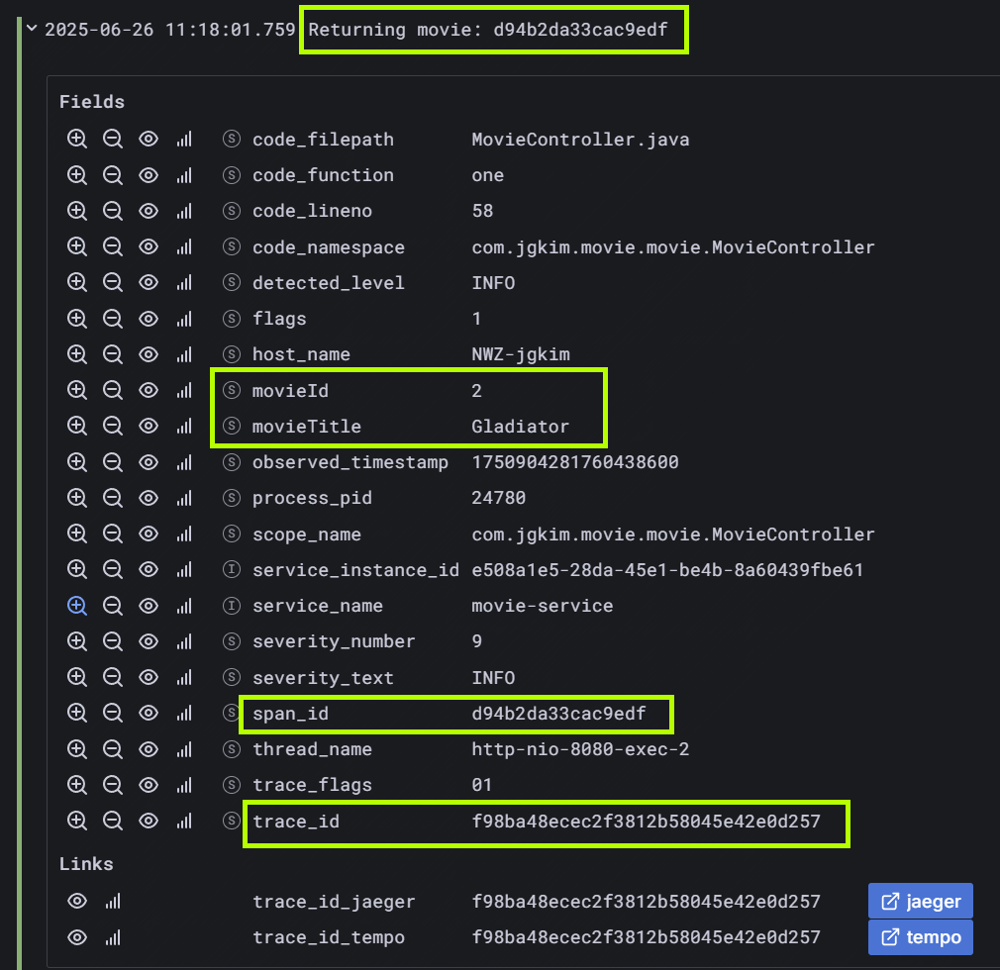

# Spring Boot + OpenTelemetry

- [Spring Boot + OpenTelemetry](#spring-boot--opentelemetry)
  - [OpenTelemetry 구성](#opentelemetry-구성)
  - [필요 패키지 설치](#필요-패키지-설치)
  - [추적 샘플링 구성, Trace](#추적-샘플링-구성-trace)
  - [Log 구성](#log-구성)
  - [Metric](#metric)
    - [기타 OpenTelemetry 구성](#기타-opentelemetry-구성)

Java Spring Boot 애플리케이션으로, 분산 추적, 메트릭스, 로깅을 위해 OpenTelemetry를 통합하는 방법을 보여줍니다.

이 애플리케이션은 추가 기능을 확장할 수 있는 간단한 영화 서비스로 설계되었습니다.

## OpenTelemetry 구성

이 애플리케이션은 추적, 메트릭, 로깅을 위해 OpenTelemetry를 사용하도록 구성되어 있습니다.

구성은 `application.properties` 파일에 정의되어 있습니다.

## 필요 패키지 설치

[build.gradle](./build.gradle) 에 필요 패키지가 나열되어 있습니다.

```java
implementation 'io.opentelemetry.instrumentation:opentelemetry-spring-boot-starter'
implementation "io.opentelemetry:opentelemetry-api"
implementation "io.opentelemetry:opentelemetry-sdk"
implementation "io.opentelemetry:opentelemetry-exporter-otlp"

// OTEL Log Exporter whit LOGBACK appender
implementation "io.opentelemetry.instrumentation:opentelemetry-logback-appender-1.0:2.15.0-alpha"
```

OpenTelemetry 관련 주요 패키지는 위와 같습니다.

## 추적 샘플링 구성, Trace

OpenTelemetry는 추적 데이터의 샘플링을 제어할 수 있도록 합니다.

이는 고트래픽 애플리케이션에서 텔레메트리 데이터의 양을 줄이는 데 유용할 수 있습니다.

추적 샘플링 비율을 조정하려면 `application.properties` 파일의 다음 속성을 수정하십시오:

```properties
# OpenTelemetry Trace Sampling Configuration
# Possible values:
# - always_on: Samples all traces (1.0 or 100%)
# - always_off: Samples no traces (0.0 or 0%)
# - traceidratio: Samples a configurable percentage of traces
otel.traces.sampler=traceidratio
# Set the sampling ratio (0.0 to 1.0, where 1.0 = 100% of traces)
otel.traces.sampler.arg=0.3
```

`otel.traces.sampler` 속성은 샘플링 전략을 정의합니다:
- `always_on`: 모든 트레이스를 샘플링합니다 (100%)
- `always_off`: 트레이스를 전혀 샘플링하지 않습니다 (0%)
- `traceidratio`: 구성 가능한 비율의 트레이스를 샘플링합니다

`traceidratio`를 사용할 때, `otel.traces.sampler.arg` 속성은 샘플링 비율을 정의합니다:
- `0.0`: 추적 기록이 전혀 샘플링되지 않습니다 (0%)
- `0.3`: 추적 기록의 30%가 샘플링됩니다
- `0.5`: 추적 기록의 50%가 샘플링됩니다
- `1.0`: 모든 추적 기록이 샘플링됩니다 (100%)

## Log 구성

이 애플리케이션은 OpenTelemetry를 사용하여 로그를 수집하고 전송합니다.
로그는 OpenTelemetry의 OTLP 프로토콜을 통해 수집됩니다.
로그 수집을 위해 `application.properties` 파일에 다음 구성을 추가합니다:

```properties
# OpenTelemetry Log Configuration
otel.logs.exporter=otlp
otel.service.name=movie-service
```

`logback-spring.xml` 파일을 사용하여 로그 형식을 구성할 수 있습니다.

```xml
<!-- OpenTelemetry appender configuration -->
<appender name="OTEL" class="io.opentelemetry.instrumentation.logback.appender.v1_0.OpenTelemetryAppender">
    <captureExperimentalAttributes>true</captureExperimentalAttributes>
    <captureCodeAttributes>true</captureCodeAttributes>
    <captureMarkerAttribute>true</captureMarkerAttribute>
    <captureKeyValuePairAttributes>true</captureKeyValuePairAttributes>
    <captureLoggerContext>true</captureLoggerContext>
    <captureMdcAttributes>
        <pattern>*</pattern>
    </captureMdcAttributes>
</appender>
```

`captureMdcAttributes`을 설정해야 MDC (Mapped Diagnostic Context) 속성을 캡처할 수 있습니다.

이는 로그 메시지에 추가 컨텍스트 정보를 포함하는 데 유용합니다.

```java
@WithSpan
@GetMapping("/movie/{id}")
Movie one(@PathVariable("id") Long id) {
    try {
        String spanId = Span.current().getSpanContext().getSpanId();
        ...
        Movie movie = this.movieService.findMovie(id);
        ...
        MDC.put("movieTitle", movie.getTitle());
        MDC.put("movieId", id.toString());
        log.info("Returning movie: {}", spanId);
        return movie;
    } finally {
        MDC.clear();
    }
}
```

위와 같이 `MDC`를 사용하여 로그 메시지에 추가 정보를 포함할 수 있습니다.



## Metric

Http 요청 Metric을 추가하기 위해서 [ControllerMetricsInterceptor](./src/main/java/com/jgkim/movie/config/ControllerMetricsInterceptor.java) 를 작성합니다.

[WebMvcConfig](./src/main/java/com/jgkim/movie/config/WebMvcConfig.java) 에서 설정 합니다.

```java
@Configuration
public class WebMvcConfig implements WebMvcConfigurer {

    private final ControllerMetricsInterceptor controllerMetricsInterceptor;

    public WebMvcConfig(ControllerMetricsInterceptor controllerMetricsInterceptor) {
        this.controllerMetricsInterceptor = controllerMetricsInterceptor;
    }

    @Override
    public void addInterceptors(InterceptorRegistry registry) {
        registry.addInterceptor(controllerMetricsInterceptor); // 설정 
    }
}
```

### 기타 OpenTelemetry 구성

```properties
# Exporter configuration
otel.exporter.otlp.endpoint=http://localhost:4318
otel.exporter.otlp.protocol=http/protobuf

# Exporters for different signal types
otel.metrics.exporter=otlp
otel.traces.exporter=otlp
otel.logs.exporter=otlp

# Service name for identification
otel.service.name=movie-service
```
