# Nest.js OpenTelematry 예제

- [Nest.js OpenTelematry 예제](#nestjs-opentelematry-예제)
  - [Description](#description)
  - [Project 셋업 및 실행](#project-셋업-및-실행)
    - [Project setup](#project-setup)
    - [Compile and run the project](#compile-and-run-the-project)
  - [Opentelemetry](#opentelemetry)
    - [Trace](#trace)
    - [Metric](#metric)
    - [Log, Winston](#log-winston)
  - [Docker](#docker)
    - [Windows](#windows)
    - [Linux, Mac](#linux-mac)
    - [docker data 저장 위치](#docker-data-저장-위치)
    - [Grafana](#grafana)
  - [Test, k6](#test-k6)

## Description

[Nest](https://github.com/nestjs/nest) framework 에서 [Otel-Colllector](https://opentelemetry.io/docs/collector/)로 Log, Metric, Trace를 전송하는 방법에 대한 예제입니다.

로컬환경에서 docker를 이용해서 테스트 가능하게 구성했습니다.

프로그램은 [Otel-Collector](https://opentelemetry.io/docs/collector/)로 Log, Metric, Trace 정보를 전송합니다.

[Otel-Collector](https://opentelemetry.io/docs/collector/)는 Log, Metric, Trace를 설정에 따라 저장소로 전송합니다.

전송이 제대로 된다면 Grafana에서 확인하고 Dashboard를 구성 가능 합니다.

| 파일명 | 설명 |
|--|--|
| [main.ts](./src/main.ts) | 프로그램 시작점 |
| [instrumentation.ts](./src/instrumentation.ts) | Otel-Collector로 전송하기 위한 대부분의 설정 |
| [app.module.ts](./src/app.module.ts) | Nest.js 모듈 설정 |

## Project 셋업 및 실행

### Project setup

```bash
$ npm install
```

### Compile and run the project

```bash
# development
$ npm run start

# watch mode
$ npm run start:dev

# production mode
$ npm run start:prod
```

## Opentelemetry

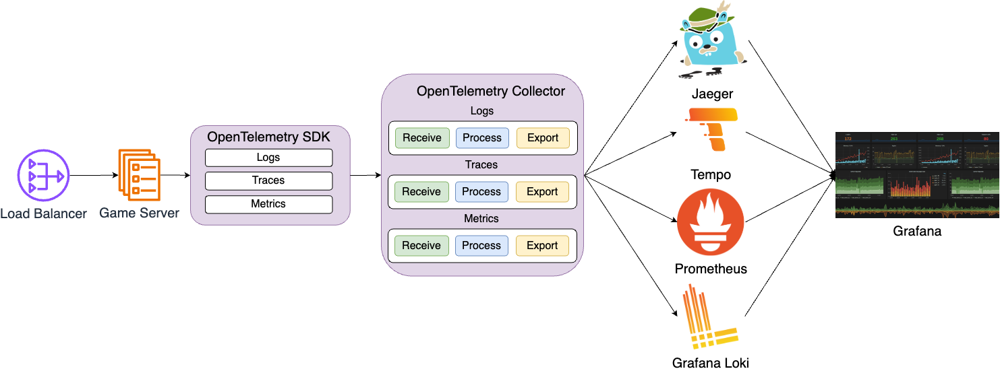

| 항목 | 전송  | |
|--|--|--|
| Log | [Loki](https://grafana.com/oss/loki/) | 예제에서는 Loki를 이용해서 로그를 저장합니다. |
| Metric | [Prometheus](https://prometheus.io/) | 예제에서는 매트릭은 Prometheus를 이용합니다. |
| Trace | [Jaeger](https://www.jaegertracing.io/), [Tempo](https://grafana.com/oss/tempo/) | 예제를 위해서 Trace정보는 Jaeger와 Tempo에 전달합니다. 실제로는 굳이 2군데 전송할 필요는 없습니다. |

### Trace

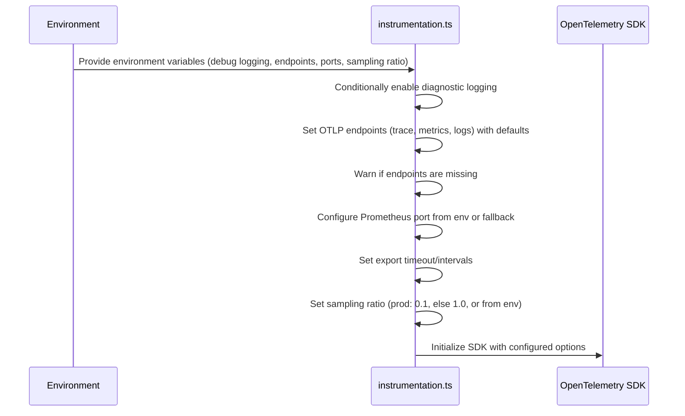

```typescript
// instrumentation.ts
const spanProcessors = () => {
  if (process.env.OTEL_TRACE_EXPORTER == 'console') {
    return [new BatchSpanProcessor(new ConsoleSpanExporter())];
  } else {
    return [
      new BatchSpanProcessor(new OTLPTraceExporter({ url: otlpTraceEndpoint })),
    ];
  }
};
```

```typescript
// instrumentation.ts
// Configure sampling rate
const defaultRatio = process.env.NODE_ENV === 'production' ? 0.1 : 1.0;
const samplingRatio = process.env.OTEL_SAMPLING_RATIO
  ? parseFloat(process.env.OTEL_SAMPLING_RATIO)
  : defaultRatio;
```

부하가 많은 실제 환경에서는 너무 많은 trace 정보는 문제가 될 가능성이 있기 때문에 환경설정 `OTEL_SAMPLING_RATIO`를 이용해서 조정합니다.

```typescript
// instrumentation.ts
const otelSDK = new NodeSDK({
  ...
  spanProcessors: spanProcessors(),
  ...
  sampler: new TraceIdRatioBasedSampler(samplingRatio),
  instrumentations: [
    getNodeAutoInstrumentations(),
    new HttpInstrumentation(),
    new ExpressInstrumentation(),
    new NestInstrumentation(),
  ...
});
```

Node.js 자동 계측을 위해서 필요한 설정을 해줍니다.

```bash
# .env
# Traces ----------------
#console, otlp
OTEL_TRACE_EXPORTER=otlp
OTEL_EXPORTER_OTLP_TRACES_PROTOCOL=http/protobuf
OTEL_EXPORTER_OTLP_TRACES_ENDPOINT=http://localhost:4318/v1/traces
OTEL_SAMPLING_RATIO=1.0
```

환경설정에서 `OTEL_TRACE_EXPORTER`를 console 로 설정하면 console 화면에 trace 결과가 출력됩니다. `otlp`로 설정시 `OTEL_EXPORTER_OTLP_TRACES_ENDPOINT`로 전송됩니다.

`OTEL_SAMPLING_RATIO`를 이용해서 sampling 비율을 조정합니다.

### Metric

```typescript
// instrumentation.ts
const metricsExporter = () => {
  // Prometheus
  if (process.env.OTEL_METRICS_EXPORTER == 'prometheus') {
    return new PrometheusExporter({
      port: parseInt(process.env.PROMETHEUS_PORT || '3002', 10),
    });
  }
  // Console
  if (process.env.OTEL_METRICS_EXPORTER == 'console') {
    return new PeriodicExportingMetricReader({
      exporter: new ConsoleMetricExporter(),
      exportTimeoutMillis: parseInt(
        process.env.OTEL_METRIC_EXPORT_TIMEOUT || '30000',
        10,
      ),
      exportIntervalMillis: parseInt(
        process.env.OTEL_METRIC_EXPORT_INTERVAL || '60000',
        10,
      ),
    });
  }
  // OTEL
  return new PeriodicExportingMetricReader({
    exporter: new OTLPMetricExporter({ url: otlpMeticEndpoint }),
    exportTimeoutMillis: parseInt(
      process.env.OTEL_METRIC_EXPORT_TIMEOUT || '15000',
      10,
    ),
    exportIntervalMillis: parseInt(
      process.env.OTEL_METRIC_EXPORT_INTERVAL || '15000',
      10,
    ),
  });
};
```

| 설정값 | 설명 |
|--|--|
| console | 확인을 위해서 지표가 console로 출력됩니다. |
| prometheus | Otel-Collector로 전송하지 않을때 선택합니다. 3002번 포트에 /metrics 주소에서 지표 확인이 가능합니다 |
| otel | Otel-Collector로 지표를 전송합니다. |

```typescript
// instrumentation.ts
const otelSDK = new NodeSDK({
  ...
  metricReader: metricsExporter(),
  ...
});
```

```bash
# .env
# Metrics ---------------
# console, prometheus, otlp
OTEL_METRICS_EXPORTER=otlp
OTEL_EXPORTER_OTLP_METRICS_PROTOCOL=http/protobuf
OTEL_EXPORTER_OTLP_METRICS_ENDPOINT=http://localhost:4318/v1/metrics
```

### Log, Winston

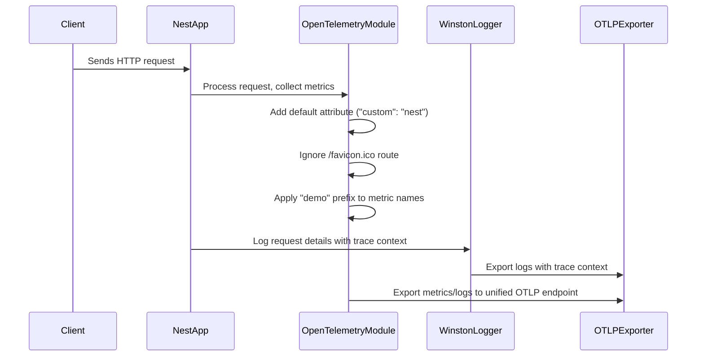

Nest.js log를 Winston과 연결하고 Winston출력을 Otel-Collector로 전송합니다.

```typescript
// main.ts
async function bootstrap() {
  // Start SDK before nestjs factory create
  otelSDK.start();
  const app = await NestFactory.create(AppModule, {
    bufferLogs: true,
  });
  app.useLogger(app.get(WINSTON_MODULE_NEST_PROVIDER));
  ...
}
bootstrap();
```

`bufferLogs: true` 시작시 log를 버퍼링하고 로그와 연결되었을때 출력합니다.

`app.useLogger(app.get(WINSTON_MODULE_NEST_PROVIDER));` Log를 winston과 연결합니다.

```typescript
// app.module.ts
@Module({
  imports: [
    ...
    WinstonModule.forRoot({
      transports: [
        new OpenTelemetryTransportV3(),
        new winston.transports.Console({
          level: process.env.NODE_ENV === 'production' ? 'info' : 'silly',
          format: winston.format.combine(
            winston.format.timestamp(),
            winston.format.json(),
            winston.format.colorize({ all: true }),
          ),
        }),
      ],
    }),
  ],
  ...
})
```

`new OpenTelemetryTransportV3(),` winston log 를 otel-collector로 전송하기 위해 설정합니다.

```typescript
// instrumentation.ts
const logExporter = new OTLPLogExporter({
  url:
    process.env.OTEL_EXPORTER_OTLP_LOGS_ENDPOINT ||
    'http://localhost:4318/v1/logs',
});
const logRecordProcessor = new logs.BatchLogRecordProcessor(logExporter);
...
const otelSDK = new NodeSDK({
  logRecordProcessors: [logRecordProcessor],
  ...
  instrumentations: [
    ...
    new WinstonInstrumentation({
      // 계측 활성화 시 로그 본문에 trace context 자동 주입 가능
      logHook: (span, record) => {
        record['trace_id'] = span.spanContext().traceId;
        record['span_id'] = span.spanContext().spanId;
        record['trace_flags'] = span.spanContext().traceFlags;
      },
    }),
  ],
  ...
});
```

log를 전송할 Otel-Collector를 설정하고 로그에 자동으로 trace_id, span_id, trace_flags를 삽입합니다.

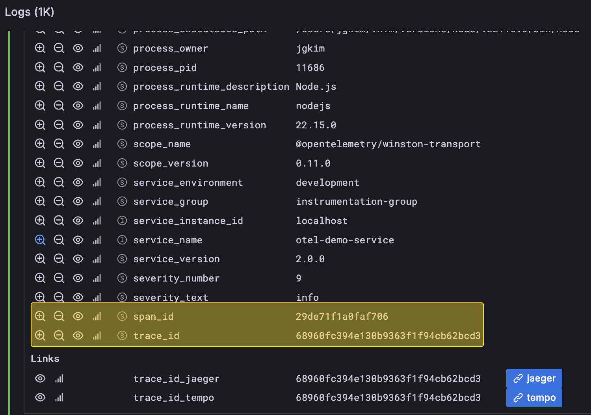

## Docker

docker 폴더에 로컬에서 테스트에 필요한 container설정이 있습니다.

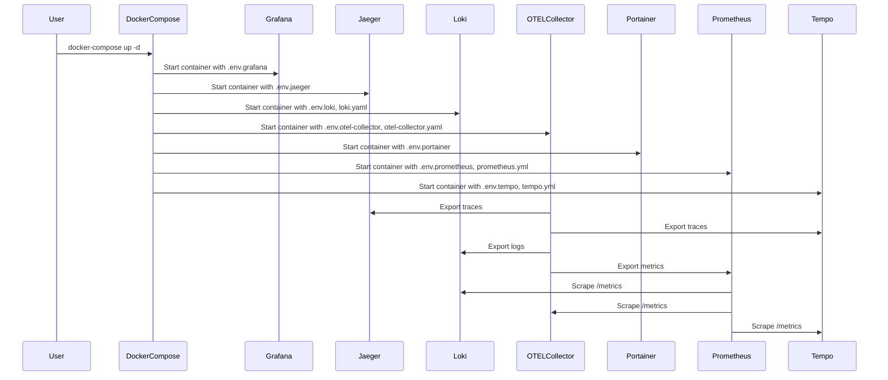

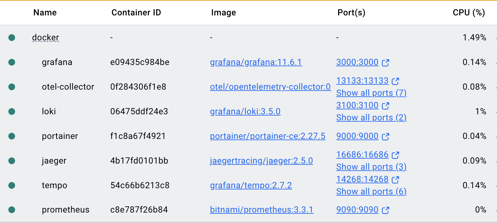

제대로 실행되면 위와같이 컨테이너들이 실행됩니다.

| 컨테이너 | 주소 | 초기 비번 |
|--|--|--|
| Grafana | http://localhost:3000/ | admin/admin |
| Jaeger | http://localhost:16686/ | |
| Prometheus | http://localhost:9090/query | |
| Portainer | http://localhost:9000/ | |

### Windows

상위의 docker폴더로 이동한다.

설정된 container들을 실행한다.

```bash
> docker compose up -d

[+] Running 7/7
 ✔ Container jaeger          Running                                                                               0.0s
 ✔ Container tempo           Running                                                                               0.0s
 ✔ Container loki            Running                                                                               0.0s
 ✔ Container portainer       Running                                                                               0.0s
 ✔ Container prometheus      Running                                                                               0.0s
 ✔ Container otel-collector  Running                                                                               0.0s
 ✔ Container grafana         Running                                                                               0.0s
```

특정 포트가 바인당이 안된다면

```bash
Error response from daemon: Ports are not available: exposing port TCP 0.0.0.0:1888 -> 127.0.0.1:0: listen tcp 0.0.0.0:1888: bind: An attempt was made to access a socket in a way forbidden by its access permissions.

> netsh interface ipv4 show excludedportrange protocol=tcp

프로토콜 tcp 포트 제외 범위

시작 포트    끝 포트
----------    --------
      1461        1560
      1661        1760
      1861        1960
      4513        4612
      4717        4816
      4838        4937
     27339       27339
     50000       50059     *

> net stop winnat
> netsh int ipv4 delete excludedportrange protocol=tcp startport=1861 numberofports=99
> net start winnat
```

바인딩 제한이 걸려 있을 수 있으니, 관리자 권한으로 포트를 제외시킨다.

### Linux, Mac

```bash
docker-compose up -d
```

### docker data 저장 위치

./docker/.env

```bash
DATA_DIR=${HOME:-$USERPROFILE}/docker-data
```

Windows의 경우 USERPROFILE/docker-data 아래에 저장된다. 테스트 이후에 필요없을시 삭제한다.

Linux, Mac일 경우 HOME/docker-data 아래에 저장된다. 테스트 이후에 필요없을시 삭제한다.

### Grafana

지표가 제대로 저장되는지 확인하기 위해서 Grafana Data Source를 설정합니다.

초기 비번은 admin/admin 입니다.

[docker-compose.yml](../docker/docker-compose.yml)

[http://localhost:3000/](http://localhost:3000/) 으로 접속합니다.

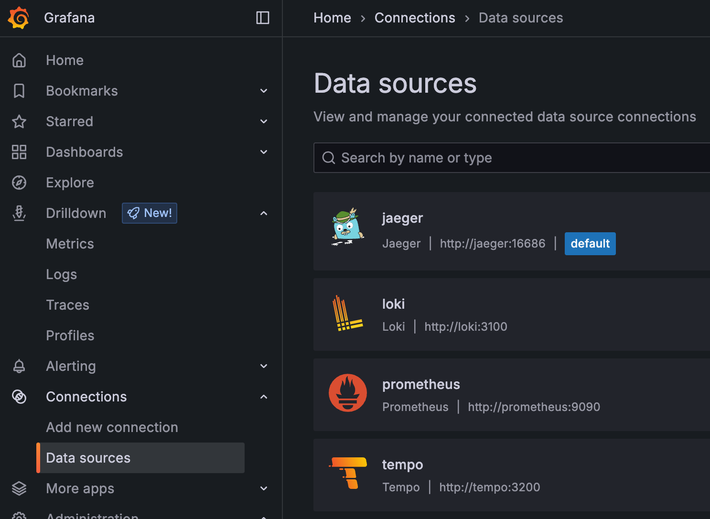

| | |
|--|--|
| jaeger | http://jaeger:16686 |
| loki | http://loki:3100 |
| prometheus | http://prometheus:9090 |
| tempo | http://tempo:3200 |

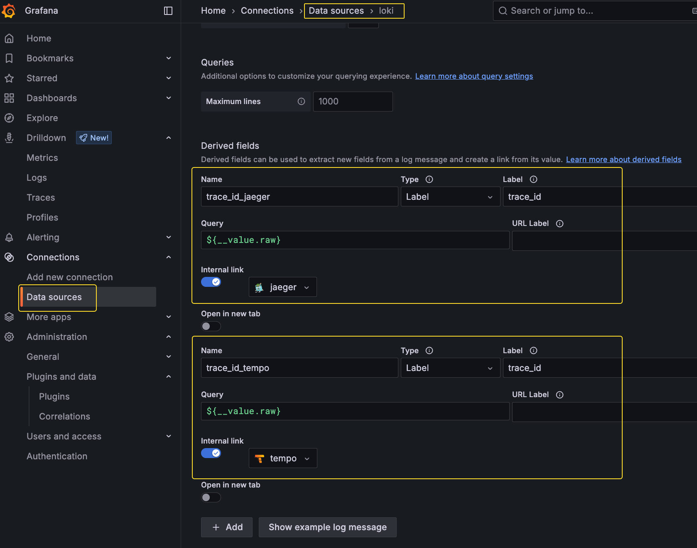

Loki data source설정에서 trace 정보를 연결합니다.

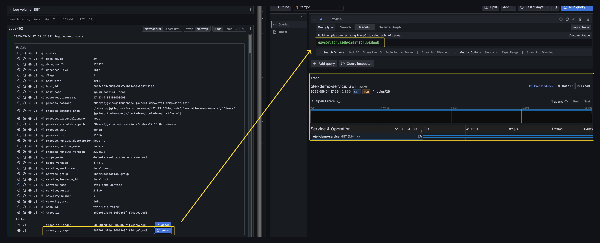

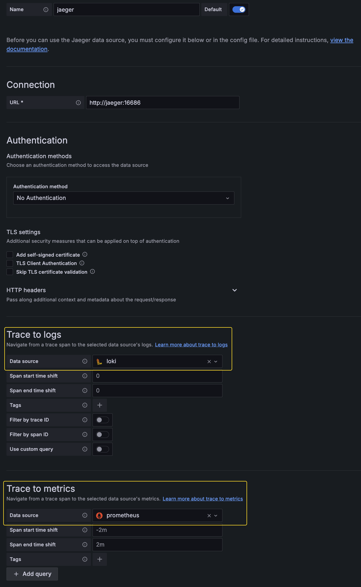

Jaeger / Tempo 설정에서도 로그 설정에서 loki 와 연결합니다.

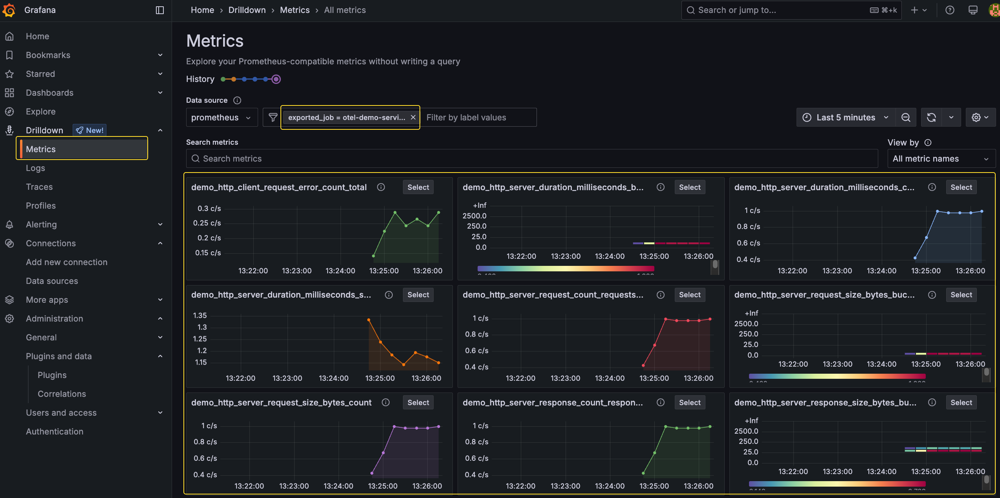

Metric이 제대로 표시되는지 확인합니다.

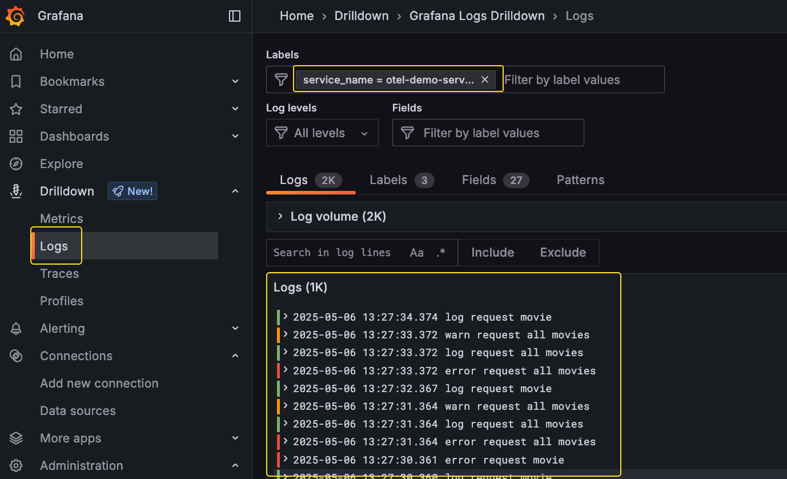

Log가 제대로 표시되는지 확인합니다.

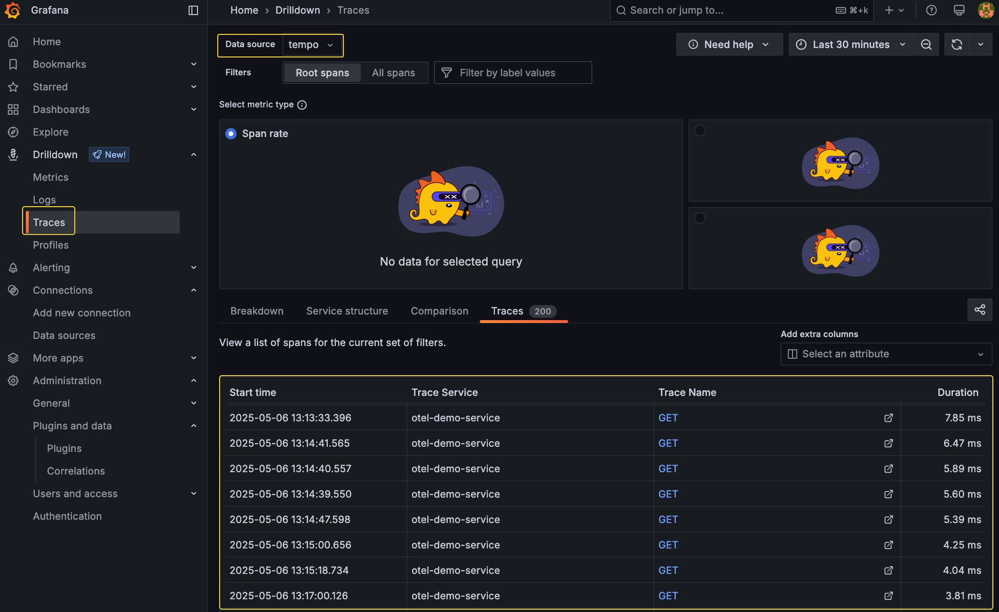

Trace가 제대로 표시되는지 확인합니다.

[metric 항목](./metric-example.md)에 따라 Dashboard를 구성할 수 있습니다.

## Test, k6

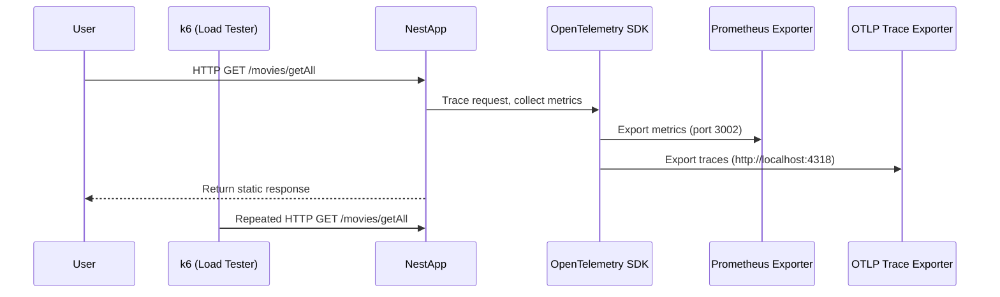

Log, Metric, Trace가 제대로 남는지 테스트 하기 위해서 [k6](https://grafana.com/docs/k6/latest/set-up/install-k6/) 스크립트를 이용해서 테스트 한다.

load_test폴더 밑에 스크립트가 있다.

[k6](https://grafana.com/docs/k6/latest/set-up/install-k6/)는 각 os에 맞게 설치가 되어 있어야 한다.

[실행법](./load_test/README.md)
