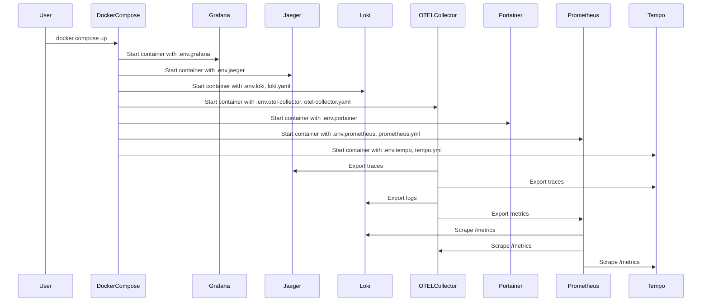

# Nest.js OpenTelematry 예제

## Description

[Nest](https://github.com/nestjs/nest) framework 에서 [Otel-Colllector](https://opentelemetry.io/docs/collector/)로 Log, Metric, Trace를 전송하는 방법에 대한 예제이다.

로컬환경에서 docker를 이용해서 테스트 가능하게 구성했다.

프로그램은 [Otel-Collector](https://opentelemetry.io/docs/collector/)로 전송만 하면 된다.

[Otel-Collector](https://opentelemetry.io/docs/collector/)에서 다른 Endpoint 전송은 인프라에서 세팅한다.

전송이 제대로 된다면 Grafana에서 확인하고 Dashboard를 구성한다.

## Project setup

```bash
$ npm install
```

## Compile and run the project

```bash
# development
$ npm run start

# watch mode
$ npm run start:dev

# production mode
$ npm run start:prod
```

## Run tests

```bash
# unit tests
$ npm run test

# e2e tests
$ npm run test:e2e

# test coverage
$ npm run test:cov
```

## Docker

docker 폴더에 로컬에서 테스트에 필요한 container설정이 있다.



### Windows

상위의 docker폴더로 이동한다.

설정된 container들을 실행한다.

```bash
> docker compose up -d

[+] Running 7/7
 ✔ Container jaeger          Running                                                                               0.0s
 ✔ Container tempo           Running                                                                               0.0s
 ✔ Container loki            Running                                                                               0.0s
 ✔ Container portainer       Running                                                                               0.0s
 ✔ Container prometheus      Running                                                                               0.0s
 ✔ Container otel-collector  Running                                                                               0.0s
 ✔ Container grafana         Running                                                                               0.0s
```

특정 포트가 바인당이 안된다면

```bash
Error response from daemon: Ports are not available: exposing port TCP 0.0.0.0:1888 -> 127.0.0.1:0: listen tcp 0.0.0.0:1888: bind: An attempt was made to access a socket in a way forbidden by its access permissions.

> netsh interface ipv4 show excludedportrange protocol=tcp

프로토콜 tcp 포트 제외 범위

시작 포트    끝 포트
----------    --------
      1461        1560
      1661        1760
      1861        1960
      4513        4612
      4717        4816
      4838        4937
     27339       27339
     50000       50059     *

> net stop winnat
> netsh int ipv4 delete excludedportrange protocol=tcp startport=1861 numberofports=99
> net start winnat
```

바인딩 제한이 걸려 있을 수 있으니, 관리자 권한으로 포트를 제외시킨다.

### Linux, Mac

```bash
docker-compose up -d
```

### docker data 저장 위치

./docker/.env

```bash
DATA_DIR=${HOME:-$USERPROFILE}/docker-data
```

Windows의 경우 USERPROFILE/docker-data 아래에 저장된다. 테스트 이후에 필요없을시 삭제한다.

Linux, Mac일 경우 HOME/docker-data 아래에 저장된다. 테스트 이후에 필요없을시 삭제한다.

## 테스트

Log, Metric, Trace가 제대로 남는지 테스트 하기 위해서 [k6](https://grafana.com/docs/k6/latest/set-up/install-k6/) 스크립트를 이용해서 테스트 한다.

load_test폴더 밑에 스크립트가 있다.

[k6](https://grafana.com/docs/k6/latest/set-up/install-k6/)는 각 os에 맞게 설치가 되어 있어야 한다.

[실행법](./load_test/README.md)
